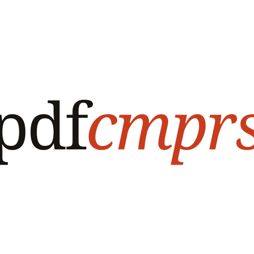

<p align="center">
  
</p>

<h1 align="center">pdfcmprs</h1>

<p align="center">
   <strong>Browser PDF toolkit built with Next.js.</strong><br>
   <em>Compress, merge, split, convert, and secure PDFs without uploading them anywhere.</em>
</p>

<p align="center">
  <a href="https://nextjs.org"></a>
  <a href="https://bun.sh"></a>
  <a href="https://tailwindcss.com"></a>
  <a href="https://github.com/kacigaya/pdfcmprs/blob/main/LICENSE"></a>
</p>

Every tool runs entirely in your browser. No document is ever sent to a server,
and the app keeps working offline once loaded.

## Tools

Each tool has its own route, such as `/compress-pdf` or `/rotate-pdf`, and the
home page is a searchable catalog. Tools are declared once in
[`app/features/pdf/registry.ts`](app/features/pdf/registry.ts), which drives the
routes, the catalog, the metadata, and the sitemap.

### Organize & Manage

| Tool | What it does |
| --- | --- |
| Merge PDF | Combine several PDFs in the order you choose |
| Split PDF | Pull specific pages or ranges into a new document |
| Extract Pages | Copy selected pages into a new PDF |
| Delete Pages | Remove selected pages, keep the rest |
| Rotate PDF | Turn selected pages by 90°, 180°, or 270° |
| Reverse Pages | Flip the page order |
| Add Blank Page | Insert blanks at the start, end, after a page, or between all |
| Alternate & Mix | Interleave two PDFs, ideal for front/back scans |
| Combine to Single Page | Stack every page onto one long or wide sheet |
| Divide Pages | Split each page into a grid of smaller pages |
| PDFs to ZIP | Bundle several PDFs into one archive, no re-encoding |
| View Metadata | Page count, dimensions, PDF version, document metadata |

### Secure & Optimize

| Tool | What it does |
| --- | --- |
| Compress PDF | Rewrite with object streams, leaving images and layout untouched |
| Encrypt PDF | Password-protect with AES-256, AES-128, or legacy RC4-40 |
| Decrypt PDF | Remove a known password |
| Change Permissions | Control printing, copying, editing, screen-reader access |
| Repair PDF | Rebuild a damaged cross-reference table |
| Linearize PDF | Reorder for fast web view |
| Remove Restrictions | Lift limits from a PDF that is not password-encrypted |
| Sanitize PDF | Strip JavaScript, auto-run actions, launch actions, attachments |

### Convert

| Tool | What it does |
| --- | --- |
| Image to PDF | Bind JPG, PNG, or WebP images into one PDF |
| PDF to Image | Render pages as PNG or JPG (ZIP for multi-page) |
| PDF to Text | Extract selectable text to a `.txt` file |

The catalog now includes more than 110 routes, including PDF/A conversion,
font outlining, rasterization and deskewing, attachment/bookmark/layer editing,
forms, visual and certificate signing, timestamping, visual comparison,
workflows, Office/OpenDocument/ebook conversion, DOCX/Markdown/AI exports, and
format-specific image converters. The registry is the authoritative live list.

## Tech stack

- Next.js 16 (App Router) with React 19
- Tailwind CSS 4 and [coss ui](https://coss.com/ui) components on Base UI
- TypeScript, Bun

PDF work is split across several engines, loaded lazily and only when a tool
that needs one actually runs:

| Engine | Used for |
| --- | --- |
| `pdf-lib` | Page structure, sanitizing, blank pages, imposition math |
| `pdfjs-dist` | Rendering, text extraction, thumbnails |
| `qpdf` (WASM) | Encryption, permissions, linearization |
| `mupdf` (WASM) | Repair, ebook conversion, SVG output |
| Ghostscript (WASM) | Image-recompressing compression, greyscale |
| CoherentPDF | Booklet, N-up, posterize, Bates numbering |
| Tesseract.js | OCR |
| wasm-vips | HEIC, PSD, TIFF, BMP |
| LibreOffice WASM | Word, Excel, PowerPoint, OpenDocument and legacy office files |
| `zgapdfsigner` | PKCS#12 signatures and RFC 3161 timestamps |

Engine binaries are copied out of `node_modules` into `public/wasm/` by
`scripts/copy-assets.ts` and served from your own origin, so a self-hosted
deployment needs no CDN access.

## Getting started

### Prerequisites

- Node.js 24+ or Bun

### Installation

```bash
bun install
```

### Development

```bash
bun run dev
```

Open [http://localhost:3000](http://localhost:3000) to view the app.

### Validation

```bash
bun run check     # typecheck, unit tests, production build
bun run test      # unit tests only
bun run build:static # export a fully static build to out/
```

The production server sends COOP/COEP headers so threaded WASM engines can use
their fastest path. Static hosts should configure the same headers when
possible. The installable PWA caches same-origin routes and engine assets after
first use, so tools remain available offline.

### Docker

```bash
docker compose up --build
```

### Project structure

```
app/                     # Next.js App Router pages, styles, layouts
app/[slug]/              # One route per tool, driven by the registry
app/components/pdf/      # Tool shell, upload zone, page grid, options form
app/components/site/     # Catalog, footer
app/features/pdf/        # Registry, hooks, and one service per operation
app/lib/                 # File, page-range, ZIP, and download helpers
app/lib/wasm/            # Lazy engine loaders
components/              # Shared UI: coss ui primitives and the navbar
scripts/                 # Build-time asset copying
public/wasm/             # Engine binaries (generated, git-ignored)
```

## Adding a tool

1. Write the operation as a plain async function in `app/features/pdf/services/`.
2. Add a panel to the matching `app/components/pdf/panels/*Panels.tsx`. Most
   tools are pure configuration via `createToolPanel`: an upload spec, option
   fields, and an `execute` function.
3. Add one entry to `TOOLS` in `app/features/pdf/registry.ts`. The route,
   catalog card, page metadata, and sitemap entry follow automatically.

## License

[AGPL-3.0-or-later](LICENSE).

The project was previously MIT. It moved to the AGPL because it bundles
Ghostscript, MuPDF, and CoherentPDF, which are AGPL-3.0; distributing them as
part of this app makes the combined work subject to the same terms. See
[NOTICE](NOTICE) for the full third-party inventory and attribution.
